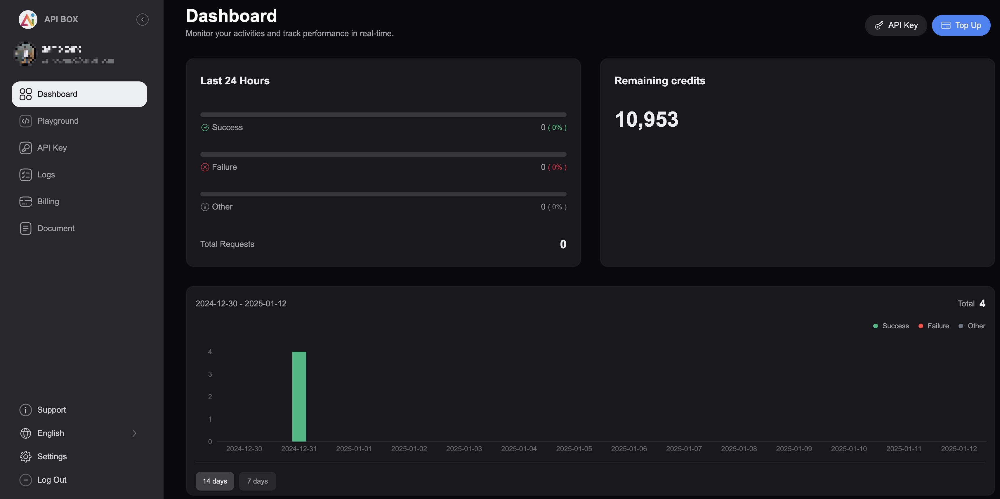

The [Suno API](https://api.box/suno) offered by api.box is an affordable platform for generating AI-powered music and lyrics. It features fast response times, high concurrency support, customizable song creation, and AI-generated lyrics with timestamps. Supporting both V3.5 and V4 versions, the Suno API ensures flexibility and scalability for developers. With stable performance, professional technical support, and detailed documentation, it's the ideal solution for integrating music generation into your projects or building music-focused platforms.

# Core Features of Suno API(Unofficial)

1. **Inspiration Mode**  
   Just enter a text prompt to generate music. For example, type "Joyful moments of travel" and submit it to Suno AI. The AI will automatically generate lyrics, compose music, and provide the lyrics, cover art, and audio file.  
   

2. **Custom Mode**  
   Allows users to tailor settings and configurations to their preferences for a more personalized experience.  
   You can customize the song’s title, style, lyrics, and other parameters, and the AI will generate a personalized song accordingly.  
   

3. **Song Continuation**  
   If a song is too long and wasn't fully generated in a single creation, you can use the continuation feature to complete the song. Alternatively, if you only like the first half of the song, you can use the continuation feature to pick up from a specific point.

4. **AI Lyrics Generator with Timestamps**  
   In Custom Mode, you can manually enter the lyrics or let the AI generate them for you. If you're not skilled at writing lyrics or lack inspiration, simply input a few keywords, and the AI will generate the full lyrics. Additionally, it supports generating timestamped lyrics, which can be combined with other requirements.  
   

---

# Core Advantages of Suno AI API

1. **Fast Responses with High Concurrency Support**  
   We use a streaming response method, which enables quick generation of results right after receiving a request, with initial results returned in about 20 seconds. The generated music files are watermark-free and of high quality. Additionally, the system supports high concurrency to handle large numbers of requests, ensuring stability under heavy traffic.

2. **Stable System with Professional Support**  
   The system has been optimized for high stability and supports long-term operation. Our professional technical support team is always available. If you encounter any issues during usage, feel free to contact us, and we will resolve them as quickly as possible.

3. **Low Cost with WeChat Pay Support**  
   One of the most cost-effective options available (prices may be adjusted in the future).

4. **Supports both Suno API V3.5 and V4**  
   Both V3.5 and V4 versions are supported. Choose the one that best fits your needs.

---

# How to Call the Suno API

1. **Get Your API Key**  
   Start by registering and logging into the API.box platform to get your API key. This key authenticates your access and ensures you can properly call the audio generation service.  
   ![Image]  

2. **Configure the Request**  
   After getting your API key, begin by setting up a POST request to generate an audio task. In the Headers, add your authorization information and set the request format to `application/json`. Then, fill in the necessary parameters in the Body, such as the audio description (prompt), style, title, whether to enable custom mode (`customMode`), and whether to generate an instrumental version. Lastly, provide a callback URL to receive the generated audio and cover art. Once the configuration is complete, click "Send Request" to submit the audio generation task to the API.  
   ![Image]  

3. **Get Your Generated Results**  
   After submitting an audio task, Suno AI API will return the generated audio and additional data via the callback URL, including the audio link, cover image, and other details. A status code of 200 indicates the task has been successfully completed.  
   ![Image]  

4. **Error Handling**  
   If a task fails, Suno AI API will return an error message. You can resolve the issue using the error code provided. For more information, refer to the API documentation or contact our support team.

---

# Additional Information

- Visit our documentation center for detailed steps: [https://api.box/suno/docs#/](https://api.box/suno/docs#/)  
- If you're new to development, you'll need to choose a suitable tool to send API requests before using Suno API. You'll also need to set up a callback URL to receive the generated audio and cover art. You can use online tools to test this setup. Once these steps are complete, you can begin configuring and using the API to generate audio.

---

# Contact Information

If you're developing your own music website or need to integrate Suno AI API and are looking for a stable, cost-effective platform, we're here to help. Currently, we offer free test requests. For more details or any issues during testing, feel free to visit our website or contact us through the following methods:

- **Official Website**: [https://api.box/suno](https://api.box/suno)  
- **Email Support**: support@api.box
